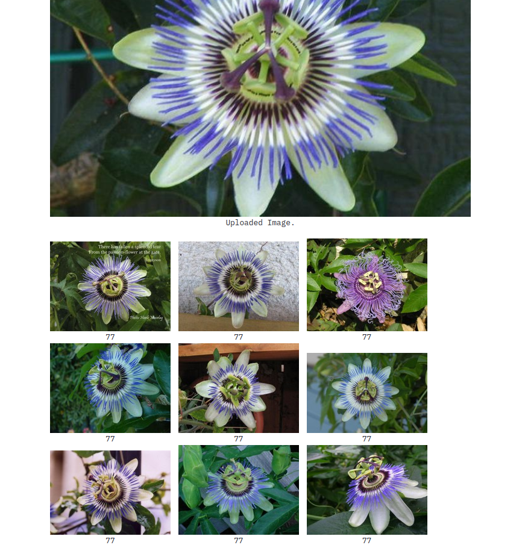

Flower retrieval with streamlit

### Dataset

- 102 category flower dataset: https://www.robots.ox.ac.uk/~vgg/data/flowers/102/

### Command

```bash
# step 1
tensorflow_model_server --port=8700 --rest_api_port=8701 --model_name=flower --model_base_path=path/to/tf-serving/model/

# step 2
streamlit run flower_st.py
```

### Result

